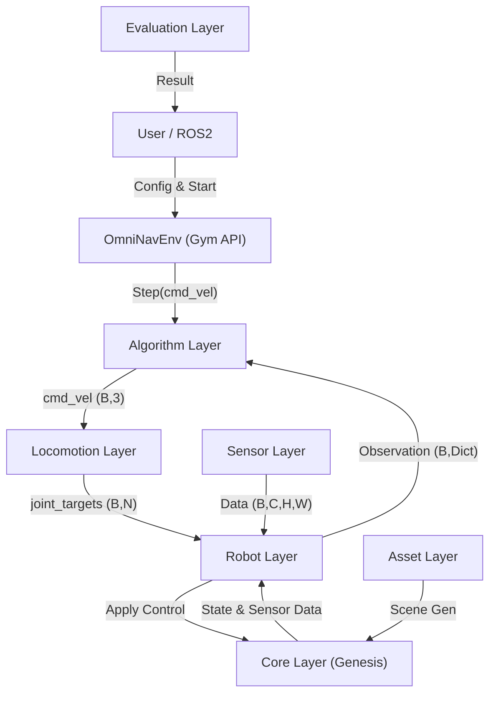
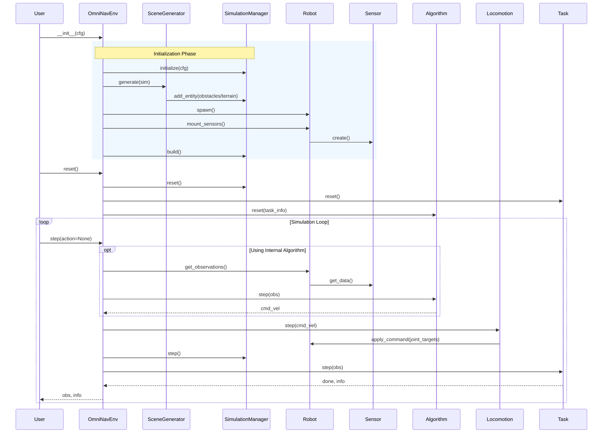

# OmniNav 详细实现计划 (Phase 3+)

## 1. 架构设计与核心原则

本项目采用**多层分层架构**，层与层之间通过标准化 API 交互。所有数据流均支持**Batch-First**维度 `(num_envs, ...)` 以充分利用 Genesis 并行仿真能力。



### 1.1 核心设计决策 (Architectural Decisions)

| 决策点         | 方案                               | 原因                                                                             |
| -------------- | ---------------------------------- | -------------------------------------------------------------------------------- |
| **数据维度**   | **Batch-First**: `(num_envs, ...)` | 统一单/多环境接口，适配 GPU 端仿真与 RL 训练。单环境也保留 Batch 维。            |
| **控制接口**   | **仅 `cmd_vel`**: `(B, 3)`         | 明确层级边界。高层规划输出速度，低层 `LocomotionController` 负责关节映射。       |
| **End-to-End** | **通过 `RLLocomotionController`**  | 若需端到端控制，将 RL 策略封装为 Locomotion Controller，接受其内部 Observation。 |
| **场景生成**   | **Asset Layer**                    | 场景生成逻辑独立于核心引擎，便于扩展和复用。                                     |
| **ROS2集成**   | **Nav2 对齐**                      | `/tf` 树结构必须包含 `map -> odom -> base_link` 链条以支持标准导航栈。           |

---

## 2. 详细目录结构 (Directory Structure)

```text
OmniNav/
├── configs/                        # Hydra 配置文件层级
│   ├── algorithm/                  # 导航/规划算法配置
│   ├── locomotion/                 # 运动控制器配置 (wheel, ik, rl)
│   ├── robot/                      # 机器人定义 (go2, go2w)
│   ├── sensor/                     # 传感器配置
│   ├── scene/                      # 场景与生成器配置
│   ├── task/                       # 评测任务配置
│   └── config.yaml                 # 全局入口配置
├── dev_docs/                       # 开发文档
│   ├── requirements.md             # 需求规格说明书
│   └── implementation_plan.md      # 本文档
├── docs/                           # 用户文档 (Sphinx)
├── external/                       # Git Submodules (Genesis, Genesis-ROS)
├── omninav/                        # 核心源码包
│   ├── algorithms/                 # [层] 算法实现 (A*, RL, VLA)
│   ├── assets/                     # [层] 资产管理与场景生成
│   │   ├── generator/              # 程序化场景生成器
│   │   ├── loader.py               # USD/URDF 加载器
│   ├── core/                       # [层] 核心引擎与注册机制
│   │   ├── registry.py             # 全局注册器
│   │   ├── simulation_manager.py   # Genesis 封装
│   ├── evaluation/                 # [层] 评测系统
│   │   ├── tasks/                  # PointNav, ObjectNav
│   │   ├── metrics/                # SPL, SR, Collision
│   ├── interfaces/                 # [层] 外部接口
│   │   ├── python_api.py           # OmniNavEnv (Gym-like)
│   │   ├── ros2/                   # ROS2 Bridge
│   ├── locomotion/                 # [层] 运动控制 (cmd_vel -> joint)
│   ├── robots/                     # [层] 机器人定义
│   └── sensors/                    # [层] 传感器实现
├── tests/                          # 单元测试与集成测试
└── examples/                       # 交互式示例脚本
```

---

## 3. 标准化 API 定义 (Standardized APIs)

所有模块开发必须严格遵守以下 API 签名。

### 3.1 核心数据结构 (Core Data Structures)

所有数据均为 Batch 格式，`B = num_envs`。

```python
# omninav/core/types.py

class RobotState(TypedDict):
    position: np.ndarray          # (B, 3) [x, y, z]
    orientation: np.ndarray       # (B, 4) [w, x, y, z] quaternion
    linear_velocity: np.ndarray   # (B, 3) world frame
    angular_velocity: np.ndarray  # (B, 3) world frame
    joint_positions: np.ndarray   # (B, num_joints)
    joint_velocities: np.ndarray  # (B, num_joints)

class Observation(TypedDict):
    # 核心状态
    robot_state: RobotState
    sim_time: float               # current time
    
    # 传感器数据 (Key 由 config 定义)
    # e.g., "front_lidar": {"ranges": (B, N), "points": (B, N, 3)}
    # e.g., "front_camera": {"rgb": (B, H, W, 3), "depth": (B, H, W)}
    
    # 任务相关 (Task Context)
    goal_position: Optional[np.ndarray]   # (B, 3) local/world frame
    goal_object: Optional[List[str]]      # (B,) target object classes
    language_instruction: Optional[List[str]] # (B,) text instructions

class Action(TypedDict):
    cmd_vel: np.ndarray           # (B, 3) [vx, vy, wz]
```

### 3.2 模块接口规范

#### Algorithm Layer
```python
class AlgorithmBase(ABC):
    @abstractmethod
    def reset(self, task_info: Dict[str, Any]) -> None:
        """Reset internal state with new task context."""
        pass

    @abstractmethod
    def step(self, obs: Observation) -> np.ndarray:
        """
        Args: obs (Batch Observation)
        Returns: cmd_vel (B, 3)
        """
        pass
```

#### Evaluation Layer
```python
class TaskBase(ABC):
    @abstractmethod
    def is_terminated(self, obs: Observation) -> Tuple[np.ndarray, np.ndarray]:
        """
        Returns: 
            dones (B, bool): 是否结束
            successes (B, bool): 是否成功
        """
        pass
```

#### Asset Layer (Scene Generator)
```python
class SceneGeneratorBase(ABC):
    @abstractmethod
    def generate(self, manager: SimulationManager, seed: int) -> None:
        """Procedurally generate scene entities."""
        pass
```

---

## 4. 生命周期时序图 (Lifecycle Sequence)



---

## 5. 阶段性开发计划

### Phase 3: 算法与运动层 (Algorithm & Locomotion)

**目标**: 实现标准化的算法接口和基础导航算法。

| 任务                 | 描述                                                                | 优先级 | 状态 |
| -------------------- | ------------------------------------------------------------------- | ------ | ---- |
| **3.0 KinematicLoco**| **(Done)** 实现游戏级运动控制器（预烘焙动画系统）。                      | High   | ✅ 完成 |
| **3.1 API 重构**     | 更新 `OmniNavEnv` 和各 Base Class 以支持 Batch-First 数据结构规范。 | High   | 🔄 进行中 |
| **3.2 WaypointAlgo** | 实现 `WaypointFollower` 算法，支持 Batch 输入。                     | High   | ⏳ 待开始 |
| **3.3 RLLocomotion** | 实现基于 RL 策略的 LocomotionController 占位符/示例。               | Medium | ⏳ 待开始 |
| **3.4 VLA 接口**     | 在 `Observation` 中添加 `language_instruction` 支持。               | Medium | ⏳ 待开始 |

#### 3.0 KinematicLoco 详细说明 (已完成)

**问题诊断**：
- 原实现每帧调用 IK 求解器，导致 5-10ms 延迟和卡顿
- Foot locking 逻辑与 IK 冲突，产生"鬼畜"抖动
- Standing mode 仍在执行完整 IK 流程，浪费资源

**解决方案**：预烘焙动画系统（参考游戏行业最佳实践）

**核心思想**：IK 只在初始化时使用一次，运行时使用快速插值

**架构**：
```
Initialization Phase (reset):
  1. Bake 32 keyframes of trot cycle using IK
  2. Store in lookup table: (32, 12) joint angles
  3. One-time cost: ~300ms

Runtime Phase (step):
  1. Update phase based on velocity
  2. Cubic interpolation between keyframes (FAST!)
  3. Smooth joint transitions
  4. Apply qpos
  Cost: ~0.1ms/frame
```

**性能提升**：
- 每帧耗时：5-10ms → 0.1ms
- 帧率：10-20 FPS → 60+ FPS
- 卡顿：明显 → 无
- 抖动：有 → 无

**技术参考**：
- Unreal Engine Animation Blueprint
- Naughty Dog "Automated Quadruped Locomotion" (GDC 2016)
- Ubisoft "Animation Bootcamp: An Indie Approach" (GDC 2017)

**文件修改**：
- `omninav/locomotion/kinematic_controller.py` - 重写核心逻辑
- `configs/locomotion/kinematic_gait.yaml` - 更新参数配置

**使用方法**：
```bash
python examples/01_teleop_go2.py
```

**预期效果**：
- ✅ WASD 控制流畅无卡顿
- ✅ 步态自然无抖动
- ✅ 可以平滑上楼梯
- ✅ 停止时平稳过渡

### Phase 4: 评测系统 (Evaluation System)

**目标**: 建立完整的任务评测闭环。

| 任务             | 描述                                                            | 优先级 |
| ---------------- | --------------------------------------------------------------- | ------ |
| **4.1 任务定义** | 实现 `PointNavTask` 和 `ObjectNavTask`。                        | High   |
| **4.2 指标实现** | 实现 SR (Success Rate), SPL (Success weighted by Path Length)。 | High   |
| **4.3 批量支持** | 确保所有 Metric 计算支持并行环境数据聚合。                      | High   |

### Phase 5: 资产与场景生成 (Asset & Procedural Gen)

**目标**: 丰富仿真环境的多样性。

| 任务               | 描述                                              | 优先级 |
| ------------------ | ------------------------------------------------- | ------ |
| **5.1 生成器基类** | 定义 `SceneGeneratorBase` 接口。                  | High   |
| **5.2 基础生成器** | 实现 `RandomObstacleGenerator` (随机障碍物布局)。 | High   |
| **5.3 复杂度评估** | 实现场景复杂度计算工具 (密度, 路径长度)。         | Medium |

### Phase 6: ROS2 深度集成 (Advanced ROS2)

**目标**: 完整的 Nav2 对接支持。

| 任务                  | 描述                                           | 优先级 |
| --------------------- | ---------------------------------------------- | ------ |
| **6.1 /tf 树完善**    | 实现 `map -> odom -> base_link` 完整变换广播。 | High   |
| **6.2 时钟同步**      | 完善 `/clock` 发布，支持 `--use-sim-time`。    | High   |
| **6.3 Action Server** | (可选) 实现基本的 NavigateToPose Action 接口。 | Low    |

---

## 6. 验证与测试策略

### 单元测试
*   每个新模块 (Algorithm, Task, Generator) 必须有对应的 `test_*.py`。
*   重点测试：**Batch 维度兼容性** (测试 `n_envs=1` 和 `n_envs=4` 的情况)。

### 集成测试
*   **Sim2Real 预备测试**: 验证 ROS2 接口输出的数据能否被 Nav2 正常消费。
*   **Benchmark 测试**: 运行 100+ 并行环境，评估 FPS 和显存占用。

---

## 7. 核心参考资料 (References)

在开发过程中，必须深入理解并充分参考以下本地子模块源码与文档，以确保 API 使用的正确性和最佳实践：

1.  **Genesis 核心引擎**: `external/Genesis`
    *   物理引擎实现与核心 API 定义。
2.  **Genesis 官方示例**: `external/Genesis/examples`
    *   包含大量场景构建、传感器使用、并行仿真的标准写法。
3.  **Genesis 官方文档**: `external/Genesis/doc`
    *   详细的 API 说明与教程。
4.  **Genesis ROS2 Bridge**: `external/genesis_ros`
    *   参考其如何高效地将 Genesis 数据转换为 ROS2 消息 (尤其是 `cv_bridge` 和点云处理部分)。
