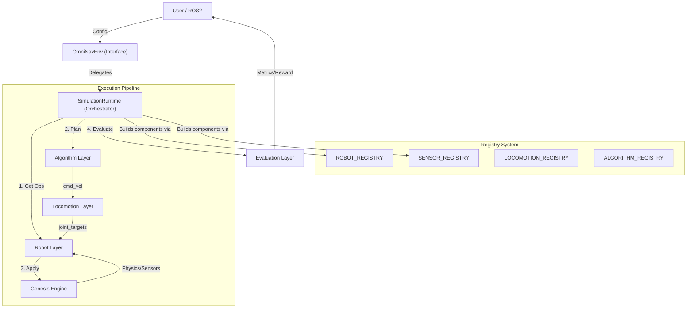
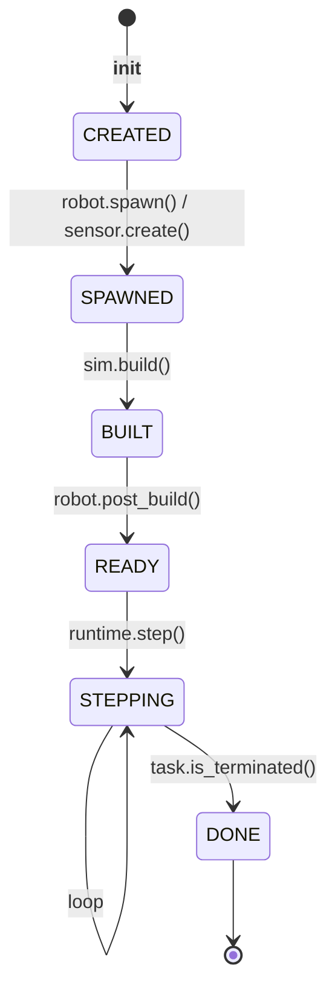
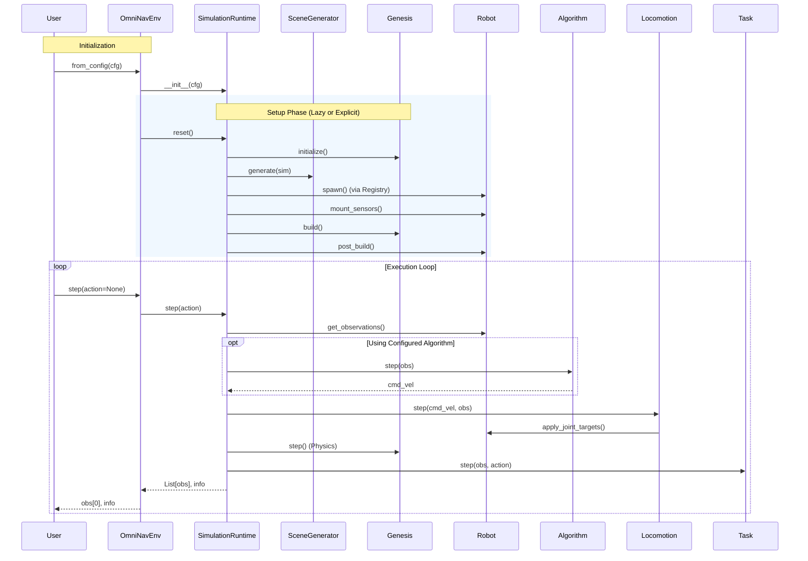

# OmniNav 详细实现计划 (Phase 3+)

## 1. 架构设计与核心原则

本项目采用**模块化、注册驱动的分层架构**。核心编排由 `SimulationRuntime` 负责，层与层之间通过标准化 API 交互。所有数据流均支持**Batch-First**维度 `(num_envs, ...)`。

### 1.1 系统架构图



### 1.2 运行时状态机 (Runtime Lifecycle)

组件生命周期由 `LifecycleMixin` 严格管理，确保初始化顺序：



### 1.3 设计理念 (Design Philosophy)

| 理念                         | 说明                                                                                                                   |
| ---------------------------- | ---------------------------------------------------------------------------------------------------------------------- |
| **Registry-Based**           | 所有组件（机器人、传感器、算法）通过统一注册器发现，实现配置驱动的实例化，无需修改核心代码即可扩展。                   |
| **Lifecycle-Managed**        | 引入显式状态机，解决传感器挂载、物理引擎构建与机器人后处理之间的时序依赖问题。                                         |
| **Orchestrated via Runtime** | `OmniNavEnv` 仅负责配置加载，`SimulationRuntime` 负责核心循环编排，使得仿真逻辑可以轻易迁移到 ROS2 或其他非 Gym 环境。 |
| **Batch-First**              | 统一单/多环境接口，适配 GPU 端大规模并行仿真。                                                                         |

### 1.4 核心设计决策 (Architectural Decisions)

| 决策点       | 方案                               | 原因                                               |
| ------------ | ---------------------------------- | -------------------------------------------------- |
| **数据维度** | **Batch-First**: `(num_envs, ...)` | 统一单/多环境接口，适配 GPU 端仿真与 RL 训练。     |
| **控制接口** | **仅 `cmd_vel`**: `(B, 3)`         | 明确层级边界。高层规划输出速度，低层渲染速度插值。 |
| **组件发现** | **Registry 机制**                  | 消除显式 import 依赖，支持更灵活的插件化开发。     |
| **状态管理** | **LifecycleMixin**                 | 强制执行初始化协议，防御性编程避免非法操作。       |

---

## 2. 详细目录结构 (Directory Structure)

```text
OmniNav/
├── configs/                        # Hydra 配置文件层级
│   ├── algorithm/                  # 导航/规划算法配置
│   ├── locomotion/                 # 运动控制器配置
│   ├── robot/                      # 机器人定义
│   ├── sensor/                     # 传感器配置
│   ├── scene/                      # 场景与生成器配置
│   ├── task/                       # 评测任务配置
│   └── config.yaml                 # 全局入口配置
├── docs/                           # 用户文档 (Docusaurus/Sphinx)
├── external/                       # Git Submodules (Genesis, etc.)
├── omninav/                        # 核心源码包
│   ├── algorithms/                 # [层] 算法实现 (A*, Inspection)
│   ├── assets/                     # [层] 资产管理与场景生成
│   ├── core/                       # [层] 核心引擎与注册机制
│   │   ├── base.py                 # 基类定义
│   │   ├── hooks.py                # HookManager (事件系统)
│   │   ├── lifecycle.py            # LifecycleMixin (状态机)
│   │   ├── registry.py             # Registry 系统
│   │   ├── runtime.py              # SimulationRuntime (核心编排)
│   │   ├── simulation_manager.py   # Genesis 封装
│   │   └── types.py                # 强类型数据结构 (Observation/Action)
│   ├── evaluation/                 # [层] 评测系统 (Tasks/Metrics)
│   ├── interfaces/                 # [层] 外部接口
│   │   ├── python_api.py           # OmniNavEnv (Gym-like)
│   │   ├── gym_wrapper.py          # Gymnasium Standard Wrapper
│   │   └── ros2/                   # ROS2 Bridge
│   ├── locomotion/                 # [层] 运动控制 (Kinematic/RL)
│   ├── robots/                     # [层] 机器人定义 (Go2/Go2w)
│   └── sensors/                    # [层] 传感器实现 (Camera/Lidar)
├── tests/                          # 单元测试与集成测试
│   ├── core/                       # 核心逻辑测试
│   ├── interfaces/                 # 接口测试
│   └── integration/                # 全流程集成测试
└── examples/                       # 交互式示例脚本 (run_inspection.py)
```

---

## 3. 标准化 API 定义 (Standardized APIs)

所有模块开发必须严格遵守以下 API 签名。

### 3.1 核心数据结构 (Core Data Structures)

所有数据均为 Batch 格式，`B = num_envs`。

```python
# omninav/core/types.py

class RobotState(TypedDict):
    position: np.ndarray          # (B, 3) [x, y, z]
    orientation: np.ndarray       # (B, 4) [w, x, y, z] quaternion
    linear_velocity: np.ndarray   # (B, 3) world frame
    angular_velocity: np.ndarray  # (B, 3) world frame
    joint_positions: np.ndarray   # (B, num_joints)
    joint_velocities: np.ndarray  # (B, num_joints)

class Observation(TypedDict):
    # 核心状态
    robot_state: RobotState
    sim_time: float               # current time
    
    # 传感器数据 (Key 由 config 定义)
    # e.g., "front_lidar": {"ranges": (B, N), "points": (B, N, 3)}
    # e.g., "front_camera": {"rgb": (B, H, W, 3), "depth": (B, H, W)}
    
    # 任务相关 (Task Context)
    goal_position: Optional[np.ndarray]   # (B, 3) local/world frame
    goal_object: Optional[List[str]]      # (B,) target object classes
    language_instruction: Optional[List[str]] # (B,) text instructions

class Action(TypedDict):
    cmd_vel: np.ndarray           # (B, 3) [vx, vy, wz]
```

### 3.2 核心模块 API

#### SimulationRuntime (核心编排器)
```python
class SimulationRuntime:
    def __init__(self, cfg: DictConfig): ...
    def build(self) -> None: 
        """触发 PRE_BUILD -> sim.build() -> post_build() -> POST_BUILD"""
    def reset(self) -> List[Observation]: ...
    def step(self, actions: Optional[List[Action]] = None) -> Tuple[List[Observation], Dict]:
        """执行 Obs -> Algo -> Loco -> Sim.step() -> Task 完整循环"""
```

#### LifecycleMixin (生命周期管理)
```python
class LifecycleMixin:
    @property
    def state(self) -> LifecycleState: ...
    def _transition_to(self, new_state: LifecycleState): ...
    def _require_state(self, required_state: LifecycleState): ...
```

#### Registry (注册器系统)
```python
class Registry:
    def register(self, name: str): ...
    def get(self, name: str) -> Type: ...
    def build(self, cfg: DictConfig, **kwargs) -> Any:
        """从配置字典中根据 'type' 字段动态构建组件实例"""
```

#### Algorithm Layer
```python
class AlgorithmBase(ABC, LifecycleMixin):
    @abstractmethod
    def reset(self, task_info: Dict[str, Any]) -> None: ...
    @abstractmethod
    def step(self, obs: Observation) -> np.ndarray:
        """返回 B,3 的 cmd_vel"""
```

#### Evaluation Layer (Task)
```python
class TaskBase(ABC, LifecycleMixin):
    @abstractmethod
    def reset(self) -> Dict: ...
    @abstractmethod
    def step(self, obs: Observation, action: Action) -> None: ...
    @abstractmethod
    def is_terminated(self, obs: Observation) -> np.ndarray: 
        """返回 B 维布尔数组"""
    @abstractmethod
    def compute_result(self) -> TaskResult: ...
```

---

## 4. 生命周期时序图 (Lifecycle Sequence)



---

## 5. 阶段性开发计划 (Project Phases) - v0.1.0

### Phase 1: 基础设施 (Foundation) ✅
- **目标**: 建立 Registry, Types, Hooks 和 Lifecycle 基础。
- **成果**: 统一的数据契约和自愈的状态管理机制。

### Phase 2: 机器人层 (Robot Layer) ✅
- **目标**: 完成 `RobotBase` 抽象及 Unitree Go2 的接入。
- **成果**: 支持 URDF 加载及关节级并行的 API。

### Phase 3: 传感器层 (Sensor Layer) ✅
- **目标**: 传感器解耦与标准化输出。
- **成果**: Camera/Raycaster 传感器返回 Batch-First 格式数据。

### Phase 4: 运动层 (Locomotion Layer) ✅
- **目标**: 实现响应式步态控制。
- **成果**: `KinematicGaitController` 实现 0.1ms/frame 的超高性能插值。

### Phase 5: 算法层 (Algorithm Layer) ✅
- **目标**: 插件式算法架构。
- **成果**: 实现 `InspectionPipeline`，支持全局规划与局部避障解耦。

### Phase 6: 评测层 (Evaluation Layer) ✅
- **目标**: 任务定义与指标。
- **成果**: 实现 `InspectionTask`，支持覆盖率、成功率、路径长度等指标计算。

### Phase 7: 接口层 (Interface Layer) ✅
- **目标**: 统一编排与外部接入。
- **成果**: 引入 `SimulationRuntime`；实现 `OmniNavEnv`, `GymWrapper`, `ROS2Bridge`。

### Phase 8: 配置与示例 (Config & Examples) ✅
- **目标**: 可用性提升。
- **成果**: 全面迁移至 Hydra 配置系统；完成 `run_inspection.py` 全流程演示。

### Phase 9: 验证与文档 (Verification) 🔄
- **目标**: 系统稳定性与知识沉淀。
- **任务**: 补充集成测试；更新 `IMPLEMENTATION_PLAN.md`, `TASK.md`, `AGENTS.md`。

---

## 6. 验证与测试策略

### 6.1 单元测试
*   每个新模块 (Algorithm, Task, Generator) 必须有对应的 `test_*.py`。
*   **Batch 维度兼容性**: 强制测试 `n_envs=1` 和 `n_envs=4` 的情况。

### 6.2 集成测试
*   使用 `tests/integration/test_full_pipeline.py` 进行端到端验证。
*   验证从 Hydra 配置组合 -> Runtime 构建 -> 机器人运行 -> 任务结束的全链路。

### 6.3 性能测试
*   **Genesis 吞吐量**: 验证在 100+ 并行环境下的物理稳定性。
*   **计算开销**: 监测 `SimulationRuntime` 在 Obs/Algo/Loco 各阶段的耗时分布。

---

## 7. 核心参考资料 (References)

1.  **Genesis 核心**: `external/Genesis` (物理引擎 API 基石)
2.  **Hydra 文档**: 关于配置组合与覆盖的官方指南。
3.  **Gymnasium API**: `OmniNavGymWrapper` 的设计标准。
4.  **Nav2 架构**: `ROS2Bridge` 输出话题的命名空间参考。
```
