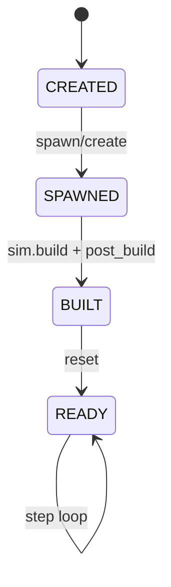
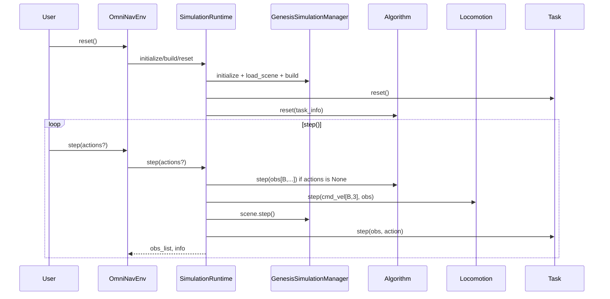

# OmniNav 详细实现计划 (v0.1)

本文档基于 `REQUIREMENTS.md` 与当前代码状态制定，目标是在 `v0.1` 周期内将现有架构收敛为需求一致、接口稳定、可持续扩展的工程版本。

## 0. 执行快照 (2026-02-12)

已完成：
1. Batch-First 主链路收敛：`cmd_vel` 统一 `(B,3)`，`Task.is_terminated` 统一 `(B,)`
2. `TaskResult` 单一真源：`omninav/core/types.py`
3. Algorithm/Task 生命周期接入 `LifecycleMixin`
4. ROS2 Bridge 修复：TypedDict 访问统一、`/tf` 发布补齐、批量传感器去 batch
5. `examples/` 全脚本 smoke 测试通过（`--test-mode --no-show-viewer`）

进行中：
1. Nav2 最小闭环样例（9C.3）
2. PointNav/ObjectNav + SR/SPL 指标体系（Phase 10）

## 1. 架构目标与现状差距

### 1.1 目标架构原则

1. **Batch-First Everything**：所有 Observation/Action/State 统一 `(B, ...)`
2. **Single Source of Truth for Types**：跨层类型只允许定义在 `omninav/core/types.py`
3. **Registry-Driven Construction**：组件创建统一通过 Registry + BuildContext
4. **Lifecycle-Managed Components**：Robot/Sensor/Locomotion/Algorithm/Task 全部状态机管理
5. **Runtime-Orchestrated Loop**：`OmniNavEnv` 只负责配置与生命周期入口

### 1.2 当前主要差距 (需优先修复)

1. Batch 语义存在 `(3,)` 与 `(B,3)` 混用
2. `TaskResult` 重复定义导致契约分叉
3. Algorithm/Task 未完全纳入生命周期状态流
4. ROS2 Bridge 与 TypedDict 访问方式不一致
5. 评测与任务体系尚未覆盖 PointNav/ObjectNav/SR/SPL

---

## 2. 目标架构图 (v0.1 目标态)

```mermaid
graph TD
    User["User / ROS2 / Trainer"] --> Env["OmniNavEnv.from_config(...)"]
    Env --> Runtime["SimulationRuntime"]

    subgraph Registry
        RR[ROBOT_REGISTRY]
        SR[SENSOR_REGISTRY]
        LR[LOCOMOTION_REGISTRY]
        AR[ALGORITHM_REGISTRY]
        TR[TASK_REGISTRY]
        MR[METRIC_REGISTRY]
    end

    Runtime -->|build(cfg, context)| RR
    Runtime -->|build(cfg, context)| SR
    Runtime -->|build(cfg, context)| LR
    Runtime -->|build(cfg, context)| AR
    Runtime -->|build(cfg, context)| TR

    Runtime --> Obs["Observation (B, ...)"]
    Obs --> Algo["Algorithm.step(obs) -> cmd_vel (B,3)"]
    Algo --> Loco["Locomotion.step(cmd_vel, obs)"]
    Loco --> Robot["Robot control API"]
    Robot --> Sim["Genesis Scene.step()"]
    Sim --> Obs
    Runtime --> Task["Task.step(obs, action)"]
    Task --> Metrics["Metric.update/compute"]
```

---

## 3. 生命周期与执行时序

### 3.1 统一状态机



### 3.2 Runtime 启动与步进



---

## 4. 标准 API 契约 (以代码落地为准)

## 4.1 类型层 (`omninav/core/types.py`)

```python
class Action(TypedDict):
    cmd_vel: np.ndarray  # (B, 3)

class Observation(TypedDict, total=False):
    robot_state: RobotState
    sim_time: float
    sensors: dict[str, SensorData]
    goal_position: Optional[np.ndarray]         # (B, 3)
    language_instruction: Optional[list[str]]   # len=B
```

约束：
1. 不允许在其他模块重复定义 `TaskResult` / `Observation` / `Action`
2. 所有跨层输入输出必须显式注明 shape

### 4.2 Runtime 层

```python
class SimulationRuntime:
    def build(self) -> None: ...
    def reset(self) -> list[Observation]: ...
    def step(self, actions: Optional[list[Action]] = None) -> tuple[list[Observation], dict]: ...
    @property
    def is_done(self) -> bool | np.ndarray: ...
```

约束：
1. `step()` 接受批量 action，内部不做隐式降维
2. `info` 必含 `step`, `sim_time`

### 4.3 Algorithm / Task 层

```python
class AlgorithmBase(ABC, LifecycleMixin):
    def reset(self, task_info: Optional[dict]) -> None: ...
    def step(self, obs: Observation) -> np.ndarray: ...  # (B, 3)

class TaskBase(ABC, LifecycleMixin):
    def reset(self) -> dict: ...
    def step(self, obs: Observation, action: Optional[Action]) -> None: ...
    def is_terminated(self, obs: Observation) -> np.ndarray: ...  # (B,)
```

---

## 5. 分阶段实施计划

### Phase 9A (P0): 架构一致性修复

目标：
1. 类型契约单一化
2. Batch 接口一致化
3. 生命周期覆盖到 Algorithm/Task

交付：
1. 合并重复类型定义
2. Runtime/Algo/Loco/Task 的 shape 断言
3. 回归测试通过

### Phase 9B (P0): 并行语义落地

目标：
1. `n_envs>1` 稳定运行
2. done/action/observation 的批量语义可追踪

交付：
1. `n_envs=4` 集成测试
2. 并行性能基准脚本

### Phase 9C (P0): ROS2 可用性达标

目标：
1. `/clock`、`/tf`、`/odom`、`/cmd_vel` 语义一致
2. Nav2 最小闭环可运行

交付：
1. ROS2 bridge 测试补齐
2. 文档化的 topic/frame 规范

### Phase 9D (P0): 文档与发布冻结

目标：
1. 文档可指导新用户完成安装、运行、扩展
2. 版本冻结前所有核心示例可复现

交付：
1. `docs/` 用户手册完成
2. 发布 checklist 全通过

### Phase 10-14 (P1/P2): 能力扩展

包含：
1. PointNav/ObjectNav + SR/SPL
2. 资产导入与程序化场景
3. VLA/VLN 接口
4. Sim2Real 高级能力与集群并行

---

## 6. 验证策略

### 6.1 单元测试

1. 每个层的新增契约必须有 `test_*.py`
2. 所有关键数组字段做 shape 测试

### 6.2 集成测试

1. `tests/integration/test_full_pipeline.py` 持续保持可运行
2. 增加 `n_envs=4` 及 ROS2 场景

### 6.3 性能与稳定性

1. 统计 `Obs/Algo/Loco/Sim/Task` 分段耗时
2. 记录 100+ env 下稳定性指标（崩溃率、数值异常、吞吐）

---

## 7. 设计约束

1. 任何 Genesis API 修改前必须查阅：
`external/Genesis/doc/source/api_reference`
2. 任何接口修改必须同步更新：
`TASK.md`、`IMPLEMENTATION_PLAN.md`、`WALKTHROUGH.md`
3. 任何新增插件必须通过 Registry 构建，不允许硬编码实例化
