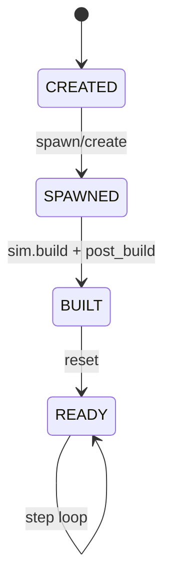
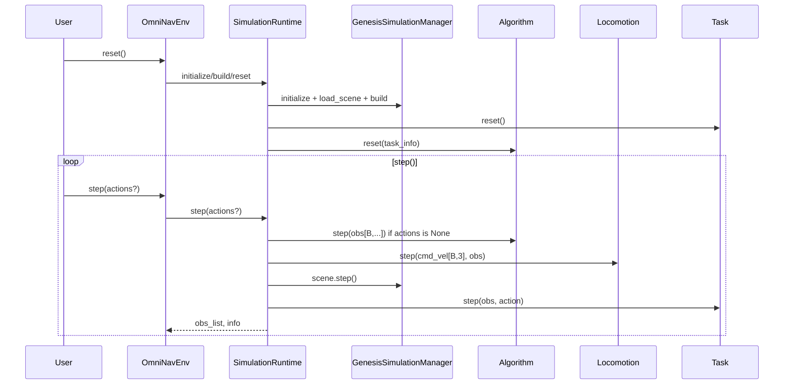

# OmniNav 详细实现计划 (v0.1)

本文档用于给出 `v0.1` 的分层实施框架与验收边界。

约束：
1. 编号统一使用 `M*`（主功能）与 `P*`（插件功能）。
2. `IMPLEMENTATION_PLAN.md` 只描述分层目标与边界，不展开逐项实现细节。
3. 详细未完成事项只写在 `TASK.md`；已完成事项只写在 `WALKTHROUGH.md`。

---

## 0. 编号与分层规范

### 0.1 编号规范
- 主功能：`M1`、`M2`、`M3`
- 插件功能：`P1`、`P2`、`P3`
- 子项：`M1.1`、`P2.3`（仅在 TASK/WALKTHROUGH 细化）

### 0.1.1 功能标题标准（与 TASK/WALKTHROUGH 逐字一致）
- `M1（L0）基础框架与导航原子能力`
- `M2（L1）巡检任务与覆盖评测能力`
- `M3（L2）复杂场景与可通行性能力`
- `P1 插件功能：ROS2 Bridge 能力`
- `P2 插件功能：示例工程化能力`
- `P3 插件功能：文档与发布冻结能力`

### 0.2 能力分层
- `L0`：导航原子能力（PointNav/ObjectNav/Waypoint）
- `L1`：巡检任务能力（覆盖率与遍历性、巡检评测闭环）
- `L2`：复杂场景能力（静态复杂场景与可通行性评估）

### 0.3 三文档映射规则
- `IMPLEMENTATION_PLAN`：定义边界与阶段目标
- `TASK`：仅记录未完成、可执行项
- `WALKTHROUGH`：仅记录已完成、含源码证据

---

## 1. 架构目标与执行边界

### 1.1 架构原则（保持不变）
1. **Batch-First Everything**：全链路 `(B, ...)`
2. **Single Source of Truth for Types**：跨层类型只在 `omninav/core/types.py`
3. **Registry-Driven Construction**：组件通过 Registry 构建
4. **Lifecycle-Managed Components**：统一生命周期状态机
5. **Runtime-Orchestrated Loop**：Runtime 编排主循环

### 1.2 v0.1 目标边界
1. 主线聚焦：`M1 + M2 + M3`
2. 插件归档：`P1 + P2` 已有能力压缩归类，作为基础支撑
3. 暂不作为 v0.1 主目标：热力专用链路、遥操作运维、网络退化硬门禁

---

## 2. 目标架构图 (v0.1)

```mermaid
graph TD
    User["User / Trainer / Plugin"] --> Env["OmniNavEnv.from_config(...)"]
    Env --> Runtime["SimulationRuntime"]

    subgraph Registry
        RR[ROBOT_REGISTRY]
        SR[SENSOR_REGISTRY]
        LR[LOCOMOTION_REGISTRY]
        AR[ALGORITHM_REGISTRY]
        TR[TASK_REGISTRY]
        MR[METRIC_REGISTRY]
    end

    Runtime -->|build(cfg, context)| RR
    Runtime -->|build(cfg, context)| SR
    Runtime -->|build(cfg, context)| LR
    Runtime -->|build(cfg, context)| AR
    Runtime -->|build(cfg, context)| TR

    Runtime --> Obs["Observation (B, ...)"]
    Obs --> Algo["Algorithm.step(obs) -> cmd_vel (B,3)"]
    Algo --> Loco["Locomotion.step(cmd_vel, obs)"]
    Loco --> Robot["Robot control API"]
    Robot --> Sim["Genesis Scene.step()"]
    Sim --> Obs
    Runtime --> Task["Task.step(obs, action)"]
    Task --> Metrics["Metric.update/compute"]

    subgraph Main Features
        M1["M1: L0 Navigation"]
        M2["M2: L1 Inspection"]
        M3["M3: L2 Complex Scene"]
    end

    subgraph Plugin Features
        P1["P1: ROS2 Bridge"]
        P2["P2: Example Engineering"]
        P3["P3: Release & Docs"]
    end
```

---

## 3. 生命周期与执行时序

### 3.1 统一状态机

```mermaid
stateDiagram-v2
    [*] --> CREATED
    CREATED --> SPAWNED: spawn/create
    SPAWNED --> BUILT: sim.build + post_build
    BUILT --> READY: reset
    READY --> READY: step loop
```

### 3.2 Runtime 启动与步进

```mermaid
sequenceDiagram
    participant U as User
    participant E as OmniNavEnv
    participant R as SimulationRuntime
    participant S as GenesisSimulationManager
    participant A as Algorithm
    participant L as Locomotion
    participant T as Task

    U->>E: reset()
    E->>R: initialize/build/reset
    R->>S: initialize + load_scene + build
    R->>T: reset()
    R->>A: reset(task_info)

    loop step()
        U->>E: step(actions?)
        E->>R: step(actions?)
        R->>A: step(obs[B,...]) if actions is None
        R->>L: step(cmd_vel[B,3], obs)
        R->>S: scene.step()
        R->>T: step(obs, action)
        R-->>E: obs_list, info
    end
```

---

## 4. Feature 分层实施框架

### 4.1 M1（L0）基础框架与导航原子能力
- 目标：构建稳定、可回归的 PointNav/ObjectNav/Waypoint 能力基线
- 输入输出边界：统一 Observation/Action batch 契约
- 验收口径：任务成功率、路径效率、碰撞与时间效率指标闭环

### 4.2 M2（L1）巡检任务与覆盖评测能力
- 目标：在导航能力上形成巡检任务闭环（覆盖率与遍历性）
- 输入输出边界：任务上下文字段与巡检指标接口
- 验收口径：巡检覆盖指标可复现，任务链路可批量运行

### 4.3 M3（L2）复杂场景与可通行性能力
- 目标：静态复杂场景构建与可通行性评估
- 输入输出边界：场景配置、难度参数、复杂度评估输出
- 验收口径：复杂场景复现、可通行评估和回归脚本可运行

### 4.4 P1 插件功能：ROS2 Bridge 能力
- 目标：保持插件化桥接能力，不作为 v0.1 主线驱动
- 边界：控制源切换、topic/frame 契约、Nav2 对接边界

### 4.5 P2 插件功能：示例工程化能力
- 目标：保证示例可复现、可 smoke、可配置组合
- 边界：`examples/*.py` + `configs/demo/*.yaml` 双层组织

### 4.6 P3 插件功能：文档与发布冻结能力
- 目标：文档一致性与发布前检查闭环
- 边界：文档同步、测试回归、示例可运行

---

## 5. 已完成基线（摘要）

说明：本节仅作为现状摘要，详细证据与完成项明细见 `WALKTHROUGH.md`。

1. M1 基础框架能力已落地：Runtime/Registry/Lifecycle/Batch-First 契约主链路
2. M2 巡检链路已打通：Inspection planner + task + 基础指标
3. P1 ROS2 插件关键链路已落地：配置契约、tf/clock、示例包与测试
4. P2 示例工程化已完成：脚本自治、demo 配置组合、smoke-fast 降载

勘误说明（基于当前源码）：
1. `cmd_vel` 的 Batch-First 契约已统一到 Runtime/Type 层；当前 locomotion 控制入口仍是“单机器人控制器 step 接口”，由 Runtime 在机器人维度调度。
2. 巡检指标中的 `detection_rate` 当前为事件记录式占位实现（通过外部记录 TP/FP/FN 计算），尚非端到端自动检测链路。

---

## 6. v0.1 验证与发布门禁

### 6.1 测试门禁
1. 新增能力必须包含单元测试与必要集成测试
2. Batch 相关能力必须验证 `n_envs=1` 与 `n_envs=4`
3. 核心测试不回归，示例脚本至少一个可运行

### 6.2 文档门禁
1. 发生 API/架构/阶段变更时，同步更新：
`REQUIREMENTS.md`、`IMPLEMENTATION_PLAN.md`、`TASK.md`、`WALKTHROUGH.md`、`AGENTS.md`
2. 编号与状态必须一致：
- `PLAN` 中出现的功能，必须在 `TASK` 或 `WALKTHROUGH` 中有对应条目

---

## 7. Genesis 对齐约束

1. 涉及 `Scene`/`Entity`/`Sensor` 改动前必须查阅：
`external/Genesis/doc/source/api_reference`
2. 行为基准优先对齐：
`external/Genesis/examples`
3. 禁止基于记忆臆测 Genesis API
