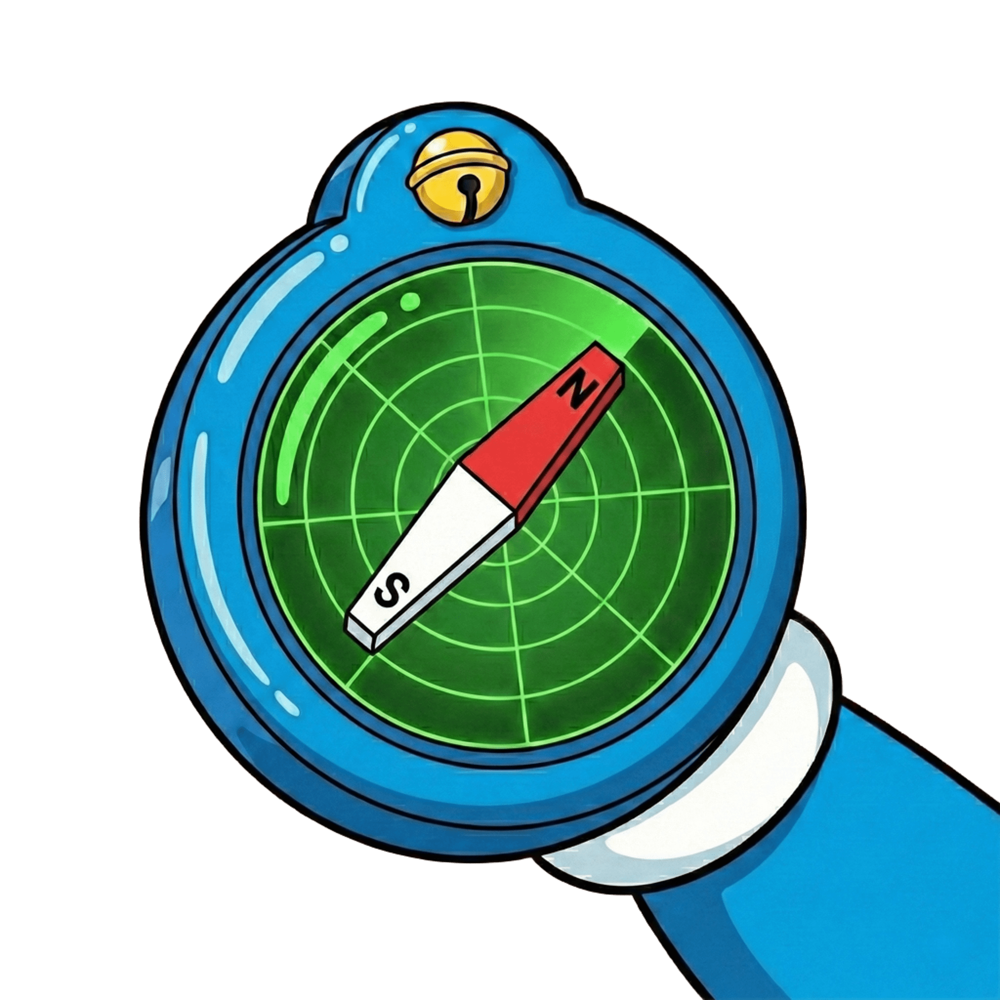

# OmniNav

<p align="center">
  
</p>

[](https://github.com/Royalvice/OmniNav)
[](https://github.com/Royalvice/OmniNav/blob/main/LICENSE)


## What is OmniNav?

OmniNav is a general-purpose navigation simulation platform built on top of the [Genesis](https://github.com/Genesis-Embodied-AI/Genesis) physics engine, designed for *Embodied AI / Robotics Navigation / Sim2Real* applications. It is simultaneously multiple things:

1. A **unified navigation benchmark** for evaluating navigation and obstacle avoidance algorithms.
2. A **plug-and-play algorithm framework** supporting both classical planners and neural network-based methods (VLA/VLN).
3. A **robot-agnostic platform** with built-in support for quadruped, wheeled, and humanoid robots.
4. A **high-fidelity simulation environment** with GPU-accelerated physics and photo-realistic rendering.

OmniNav is built with the following **long-term missions**:

1. **Simplifying navigation research** by providing a ready-to-use benchmark with standardized evaluation metrics.
2. **Bridging the Sim2Real gap** with high-fidelity physics simulation and optional ROS2 integration.
3. **Accelerating algorithm development** with a modular, extensible architecture.

## Key Features

- 🚀 **High Performance**: Leverages Genesis engine for GPU-accelerated physics simulation (43M+ FPS on RTX 4090).
- 🔌 **Plug-and-Play Algorithms**: Easy integration of classical planners, RL policies, and VLA/VLN models.
- 📊 **Built-in Evaluation**: Pre-defined navigation tasks with standard metrics (SPL, Success Rate, Collision Rate).
- 🤖 **Multi-Robot Support**: Quadruped (Go2), wheeled robots, and extensible to other platforms.
- 🌐 **ROS2 Compatible**: Optional ROS2 bridge for Sim2Real deployment.
- 📦 **Scene Import**: Support for USD, GLB, OBJ, and custom scene assets.
- 🎨 **Photo-Realistic Rendering**: Ray-tracing based rendering for realistic visual observations.
- 🔧 **Configuration-Driven**: Hydra-based configuration for flexible experiment management.

## Quick Start

### Installation

```bash
pip install omninav
```

You also need to install **PyTorch** following the [official instructions](https://pytorch.org/get-started/locally/).

### Basic Example

```python
from omninav import OmniNavEnv

env = OmniNavEnv(config_path="configs")
obs = env.reset()

while not env.is_done:
    action = env.algorithm.step(obs)
    obs, info = env.step(action)

result = env.get_result()
print(f"Success: {result.success}")
```

### Documentation

Please refer to our [User Guide](user_guide/index) for detailed installation steps, tutorials and API references.

## Contributing

We welcome contributions from the community. Please see our [Contributing Guide](user_guide/contributing) for more information.

## Citation

If you use OmniNav in your research, please consider citing:

```
@misc{OmniNav,
  author = {OmniNav Contributors},
  title = {OmniNav: A General-Purpose Navigation Simulation Platform for Embodied AI},
  year = {2025},
  url = {https://github.com/Royalvice/OmniNav}
}
```

```{toctree}
:maxdepth: 1

user_guide/index
api_reference/index
changelog
```
