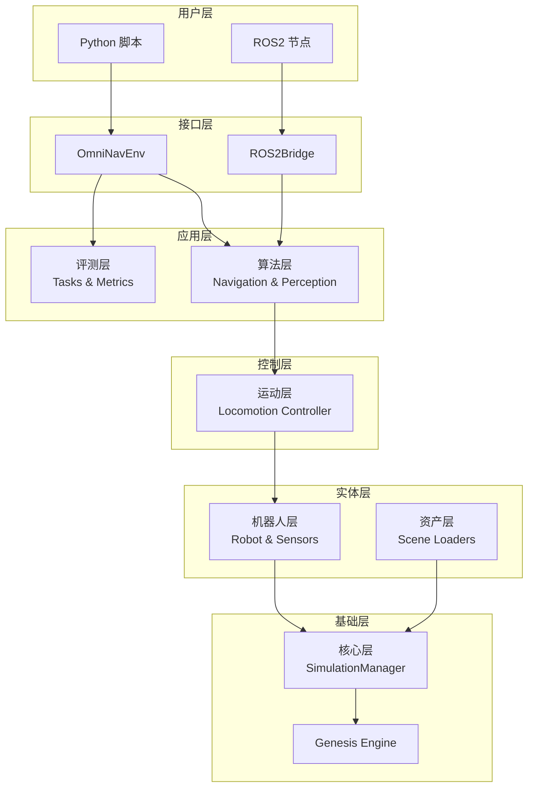
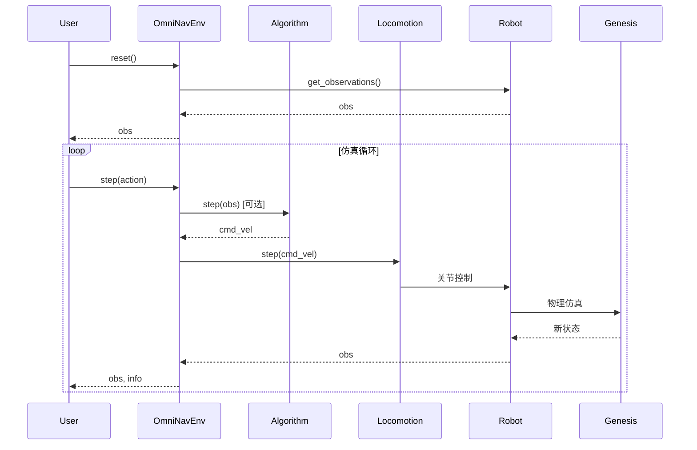

# 架构概览

OmniNav 采用分层架构设计，确保各模块解耦且可独立扩展。

## 架构图



## 设计原则

### 1. 分层解耦

每一层只依赖其下层接口，不直接访问跨层组件：

- ✅ 算法层 → 运动层 → 机器人层
- ❌ 算法层 → 机器人层 (跳过运动层)

### 2. 接口优先

所有模块定义抽象基类 (ABC)，具体实现通过注册机制发现：

```python
# 定义基类
class AlgorithmBase(ABC):
    @abstractmethod
    def step(self, observation) -> np.ndarray: ...

# 注册实现
@ALGORITHM_REGISTRY.register("my_algorithm")
class MyAlgorithm(AlgorithmBase):
    def step(self, observation):
        return np.array([0.1, 0.0, 0.0])

# 通过配置使用
# algorithm:
#   type: my_algorithm
```

### 3. 配置驱动

使用 Hydra/OmegaConf 统一管理所有配置，支持：

- 组合配置 (defaults)
- 命令行覆盖
- 多运行 (multirun)

### 4. 可选依赖

ROS2 相关功能通过配置开关控制，不影响纯 Python 使用：

```yaml
ros2:
  enabled: false  # 设为 true 以启用 ROS2 桥接
```

## 各层职责

| 层级 | 职责 | 关键类/接口 |
|------|------|------------|
| **核心层** | Genesis 封装、场景管理、仿真循环 | `SimulationManager` |
| **资产层** | 加载 USD/GLB/Mesh 场景资产 | `AssetLoaderBase` |
| **机器人层** | 机器人实体、传感器管理 | `RobotBase`, `SensorBase` |
| **运动层** | 将 cmd_vel 转换为关节控制 | `LocomotionControllerBase` |
| **算法层** | 可插拔的导航/感知算法 | `AlgorithmBase` |
| **评测层** | 任务定义与指标计算 | `TaskBase`, `MetricBase` |
| **接口层** | 对外 API (Python/ROS2) | `OmniNavEnv`, `ROS2Bridge` |

## 数据流



## 下一步

- [机器人配置](robots.md) - 如何配置和扩展机器人
- [算法集成](algorithms.md) - 如何添加自定义算法
- [评测任务](evaluation.md) - 如何定义评测任务和指标
