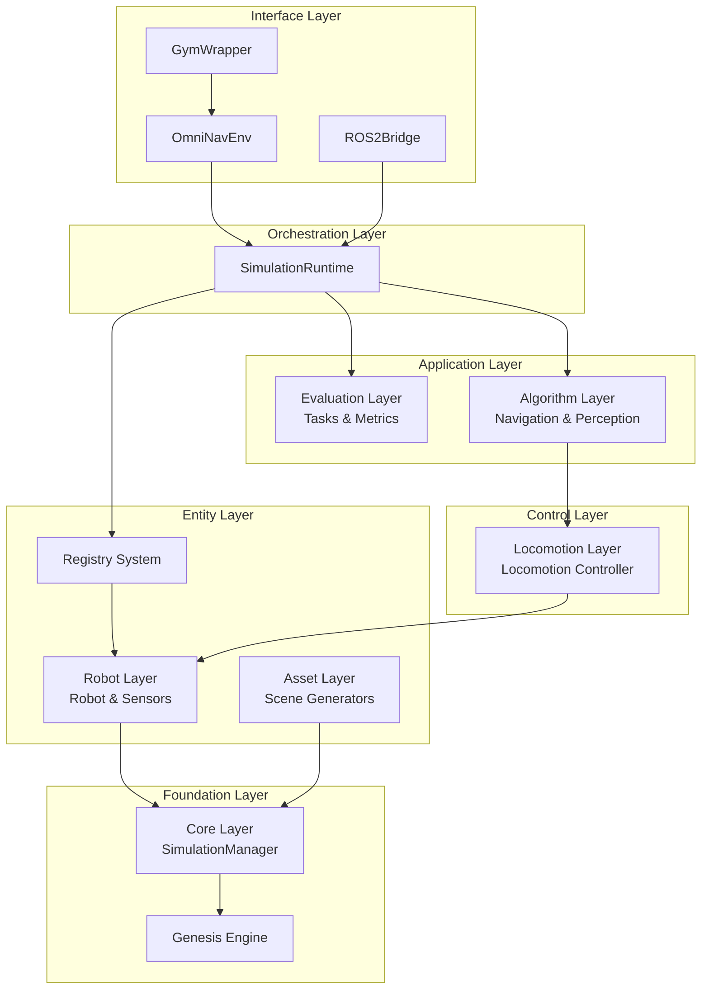
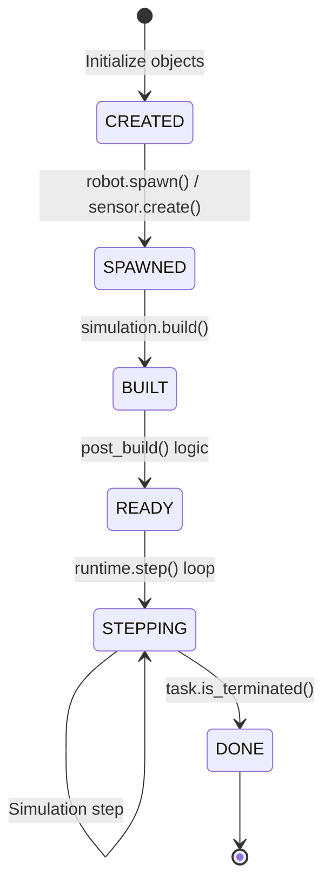
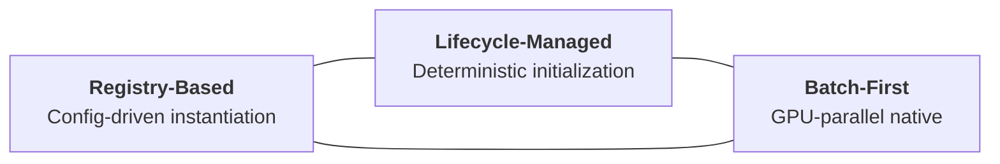
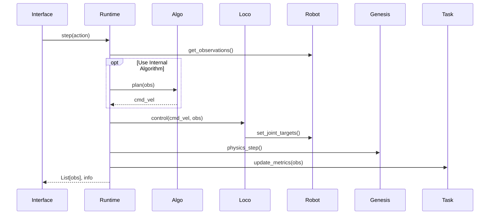

# Architecture Overview

OmniNav adopts a layered, registry-driven architecture to ensure effective decoupling and scalability. The core of the simulation is orchestrated by the `SimulationRuntime`.

## System Architecture

The following diagram illustrates the relationship between the major layers:

## Runtime Lifecycle

Component initialization and simulation steps follow a strict state machine managed by `LifecycleMixin`:

## Core Design Philosophy

OmniNav is built on three pillars that ensure flexibility and performance:

| Principle             | Description                                                                                                                                                                                          |
| --------------------- | ---------------------------------------------------------------------------------------------------------------------------------------------------------------------------------------------------- |
| **Registry-Based**    | All components (robots, sensors, controllers) are registered in a central registry. This allows the system to instantiate components dynamically from YAML configurations without hardcoded imports. |
| **Lifecycle-Managed** | Explicit states (CREATED, SPAWNED, BUILT, READY) prevent timing issues between sensor mounting, physics building, and robot post-processing.                                                         |
| **Batch-First**       | All data interfaces support `(num_envs, ...)` tensors. This allows seamless switching between single-environment debugging and massive multi-environment RL training.                                |

## Layer Responsibilities

| Layer                | Responsibility                                         | Key Class/Interface                      |
| -------------------- | ------------------------------------------------------ | ---------------------------------------- |
| **Core Layer**       | Genesis wrapper, SimulationRuntime orchestrator, Hooks | `SimulationManager`, `SimulationRuntime` |
| **Asset Layer**      | Procedural scene generation and asset loading          | `SceneGeneratorBase`, `AssetLoader`      |
| **Robot Layer**      | Robot kinematic/dynamic state, sensor mounting         | `RobotBase`, `SensorBase`                |
| **Locomotion Layer** | High-level cmd_vel to low-level joint target mapping   | `LocomotionControllerBase`               |
| **Algorithm Layer**  | Planning, collision avoidance, and perception logic    | `AlgorithmBase`                          |
| **Evaluation Layer** | Goal-directed tasks and metric calculation             | `TaskBase`, `MetricBase`                 |
| **Interface Layer**  | External APIs (Gym-like, ROS2, Gymnasium)              | `OmniNavEnv`, `ROS2Bridge`               |

## Data Flow (Runtime Step)

## Next Steps

- [Robot Configuration](robots.md) - How to configure and extend robots
- [Algorithm Integration](algorithms.md) - How to add custom algorithms
- [Evaluation Tasks](evaluation.md) - How to define evaluation tasks and metrics
