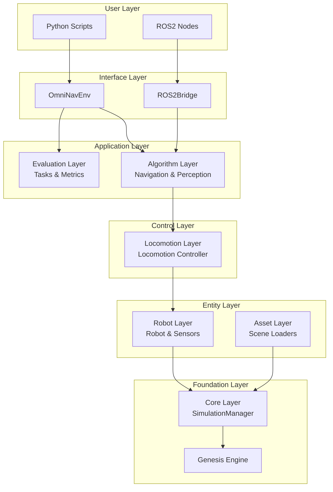
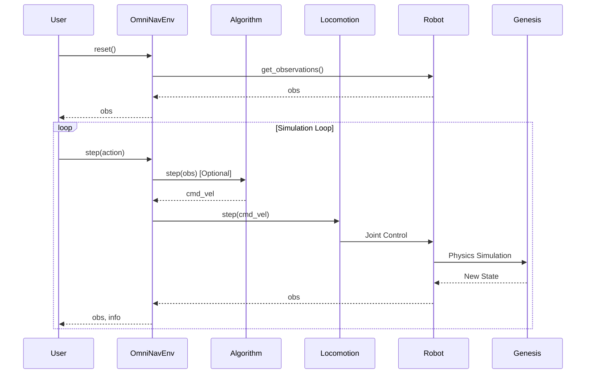

# Architecture Overview

OmniNav adopts a layered architecture design to ensure effective decoupling and independent scalability of modules.

## Architecture Diagram



## Design Principles

### 1. Layered Decoupling

Each layer depends only on the interface of the layer below it, without direct access to cross-layer components:

- ✅ Algorithm Layer → Locomotion Layer → Robot Layer
- ❌ Algorithm Layer → Robot Layer (Skipping Locomotion Layer)

### 2. Interface First

All modules define Abstract Base Classes (ABCs), and concrete implementations are discovered via a registry mechanism:

```python
# Define base class
class AlgorithmBase(ABC):
    @abstractmethod
    def step(self, observation) -> np.ndarray: ...

# Register implementation
@ALGORITHM_REGISTRY.register("my_algorithm")
class MyAlgorithm(AlgorithmBase):
    def step(self, observation):
        return np.array([0.1, 0.0, 0.0])

# Use via config
# algorithm:
#   type: my_algorithm
```

### 3. Config Driven

Use Hydra/OmegaConf to unify management of all configurations, supporting:

- Composition (defaults)
- Command line overrides
- Multirun

### 4. Optional Dependencies

ROS2 related features are controlled by config switches, not affecting pure Python usage:

```yaml
ros2:
  enabled: false  # Set to true to enable ROS2 bridge
```

## Layer Responsibilities

| Layer | Responsibility | Key Class/Interface |
|------|------|------------|
| **Core Layer** | Genesis wrapper, scene management, simulation loop | `SimulationManager` |
| **Asset Layer** | Load USD/GLB/Mesh scene assets | `AssetLoaderBase` |
| **Robot Layer** | Robot entity, sensor management | `RobotBase`, `SensorBase` |
| **Locomotion Layer** | Convert cmd_vel to joint control | `LocomotionControllerBase` |
| **Algorithm Layer** | Pluggable navigation/perception algorithms | `AlgorithmBase` |
| **Evaluation Layer** | Task definition and metric calculation | `TaskBase`, `MetricBase` |
| **Interface Layer** | External API (Python/ROS2) | `OmniNavEnv`, `ROS2Bridge` |

## Data Flow



## Next Steps

- [Robot Configuration](robots.md) - How to configure and extend robots
- [Algorithm Integration](algorithms.md) - How to add custom algorithms
- [Evaluation Tasks](evaluation.md) - How to define evaluation tasks and metrics
